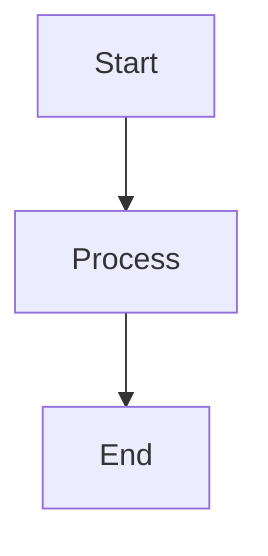

# Mermaid Chart Generator (Python)

A powerful Python tool for converting Markdown files with Mermaid diagrams to DOCX documents and PNG images. Includes both command-line and GUI interfaces for flexible usage.

## Features

- **Graphical User Interface**: Easy-to-use GUI for file selection and export
- **Command Line Interface**: Scriptable automation for batch processing
- **Markdown to DOCX Conversion**: Convert Markdown files to Microsoft Word format
- **Mermaid Diagram Extraction**: Automatically detect and extract Mermaid code blocks
- **PNG Generation**: Convert Mermaid diagrams to high-quality PNG images
- **Cross-Platform**: Works on Windows, macOS, and Linux
- **Automatic Dependency Setup**: Scripts to install required tools automatically
- **Output Directory Selection**: Choose custom output locations for generated files

## Quick Start

### Installation
```bash
# Install Python dependencies
pip install -r requirements.txt

# Install Mermaid CLI globally
npm install -g @mermaid-js/mermaid-cli

# Install Pandoc (see https://pandoc.org/installing.html)
```

### Automated Setup (Recommended)
```bash
# Run setup script to install all dependencies
python setup_env.py

# Launch GUI application
python gui_tool.py
```

## Usage

### GUI Interface
```bash
# Launch the graphical interface
python gui_tool.py
```

The GUI allows you to:
- Select Markdown files via file browser
- Choose output directory for generated files
- Generate DOCX documents with embedded diagrams
- Export flowcharts to PNG images
- Monitor conversion progress visually

### Command Line Usage
```bash
# Convert Markdown to DOCX with embedded diagrams
python export_document.py your_document.md

# Export only flowcharts to PNG images
python export_flowcharts_only.py your_document.md

# Specify custom output directory
python export_document.py your_document.md --output-dir my_output
```

### Markdown Format
Your Markdown file should include Mermaid diagrams like this:
````markdown

````

## File Structure
```
mermaid-chart-generator/
├── gui_tool.py            # Graphical user interface
├── export_document.py     # Main export script (CLI)
├── export_flowcharts_only.py # Flowchart-only export (CLI)
├── setup_env.py           # Environment setup script
├── user_guideline.md      # Comprehensive user guide
├── requirements.txt       # Python dependencies
├── LICENSE               # Jimmywongiot license
└── README.md             # This file
```

## For Users

### Getting Started
1. Install the required dependencies using the setup script
2. Launch the GUI tool or use command-line scripts
3. Select your Markdown file and output directory
4. Generate DOCX documents or PNG images

### Common Use Cases
- Technical documentation with embedded diagrams
- Process flow documentation
- Architecture diagrams in reports
- Automated documentation generation

## For Developers

### Building from Source
```bash
# Clone the repository
git clone <repository-url>
cd mermaid-chart-generator

# Install development dependencies
pip install -r requirements.txt

# Run tests (if available)
python -m pytest
```

### Extending Functionality
The tool can be extended by:
- Adding new export formats
- Customizing diagram styles
- Integrating with CI/CD pipelines
- Adding new Mermaid diagram types

### API Reference
The main classes are:
- `DocumentExporter` in `export_document.py`
- `FlowchartExporter` in `export_flowcharts_only.py`
- `MermaidGUI` in `gui_tool.py`

## Deployment Options

### Standalone Application
Package as a standalone executable using PyInstaller for easy distribution.

### Python Package
Install via pip for integration into other Python projects.

### Source Distribution
Distribute as source code for custom deployments.

## Examples

Sample Markdown files with Mermaid diagrams are available in the `examples/` directory.

## Contributing

1. Fork the repository
2. Create a feature branch (`git checkout -b feature/amazing-feature`)
3. Commit your changes (`git commit -m 'Add amazing feature'`)
4. Push to the branch (`git push origin feature/amazing-feature`)
5. Open a Pull Request

## License

This project is licensed under the Jimmywongiot License - see [LICENSE](LICENSE) file for details.

## Support

For support and questions:
- Check the comprehensive [user_guideline.md](user_guideline.md)
- Review the troubleshooting section in the user guide
- Check for known issues in the documentation

## Acknowledgments

- Mermaid.js team for the excellent diagramming library
- Pandoc team for the document conversion tool
- Python community for excellent tooling
