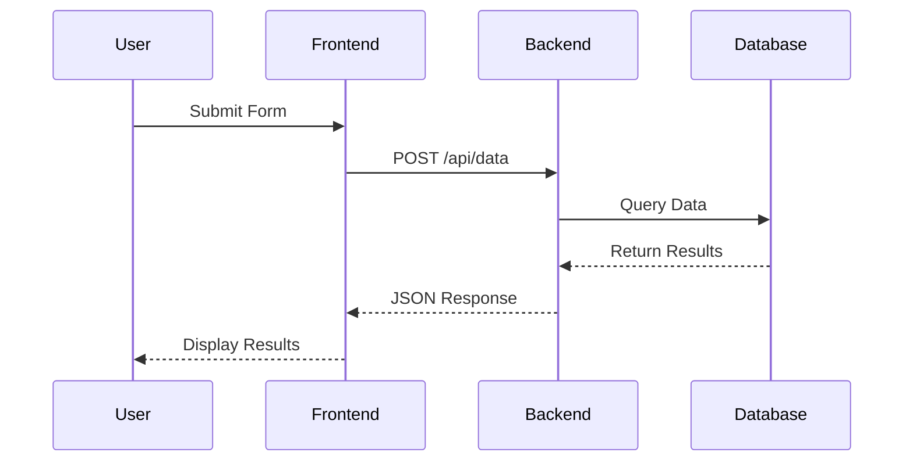
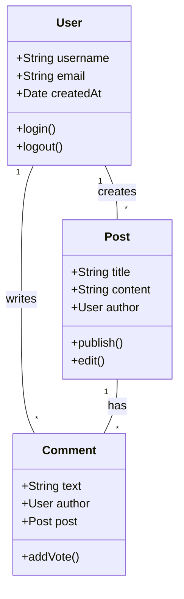
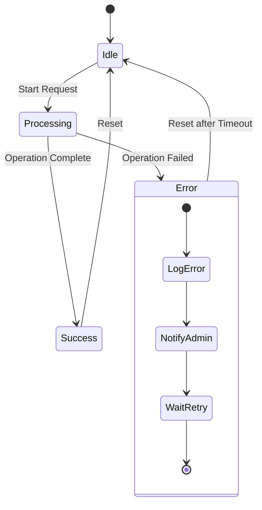
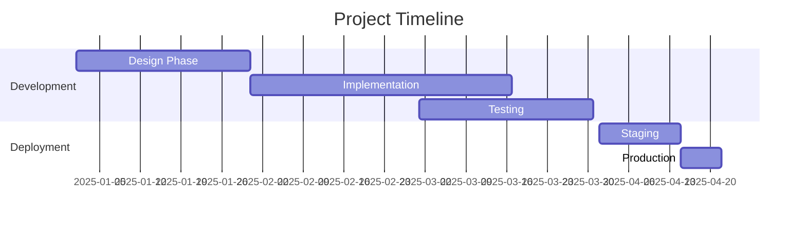
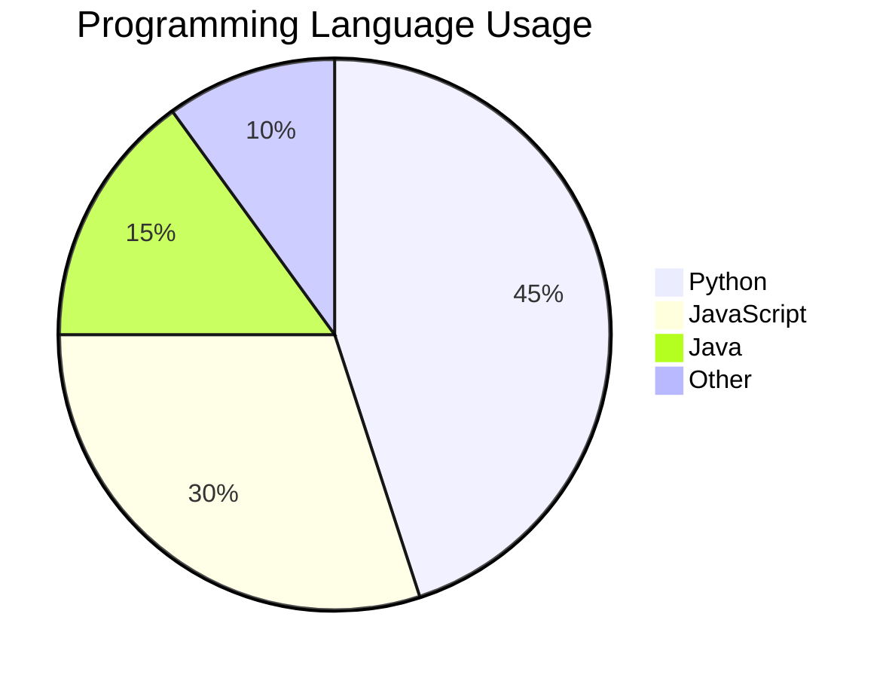

# Advanced Mermaid Diagrams Example

This example demonstrates various Mermaid diagram types beyond basic flowcharts.

## Sequence Diagram



## Class Diagram



## State Diagram



## Gantt Chart



## Pie Chart



## Testing Guidelines

### Expected Output
- Sequence Diagram: 1 PNG
- Class Diagram: 1 PNG  
- State Diagram: 1 PNG
- Gantt Chart: 1 PNG
- Pie Chart: 1 PNG
- Total: 5 PNG files

### Test Commands
```bash
# Generate complete DOCX with all diagrams
python export_document.py examples/advanced_diagrams.md

# Export only diagrams to PNG
python export_flowcharts_only.py examples/advanced_diagrams.md

# Expected output directory: flowchats/ with 5 PNG files
```

### Verification
- Check that all diagram types are properly rendered
- Verify PNG files are created with correct content
- Test both DOCX generation and PNG export functionality
