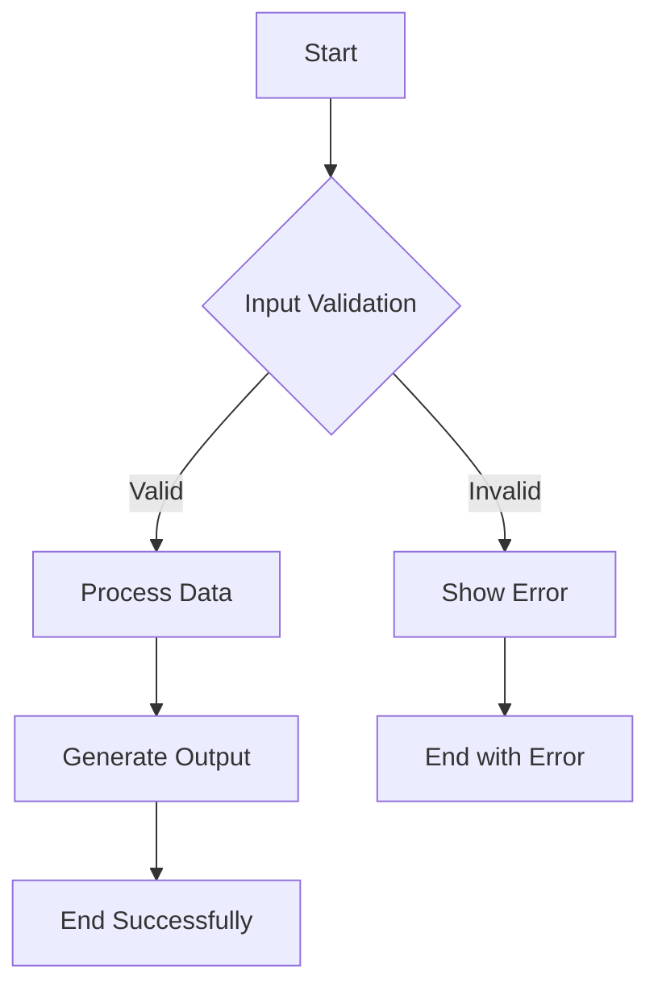
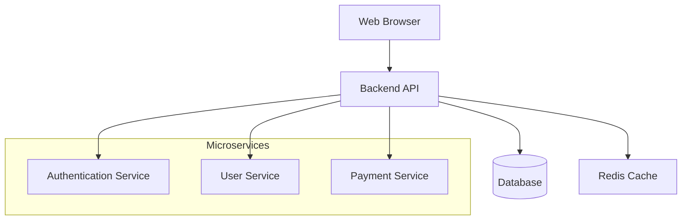

# Basic Flowchart Example

This example demonstrates a simple flowchart using Mermaid syntax.

## Simple Process Flow

## User Registration Process

## System Architecture

## Testing Notes
- This file contains 3 different flowchart examples
- Each demonstrates different Mermaid features:
  - Basic nodes and arrows
  - Conditional logic (diamond shapes)
  - Subgraphs for grouping
  - Different arrow styles

To test:
1. Use `python export_document.py examples/basic_flowchart.md` to generate DOCX
2. Use `python export_flowcharts_only.py examples/basic_flowchart.md` to export PNGs
3. Expected output: 3 PNG files in the flowchats/ directory
