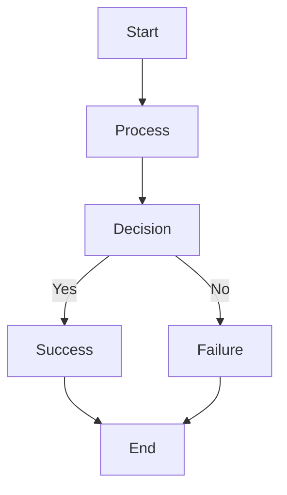
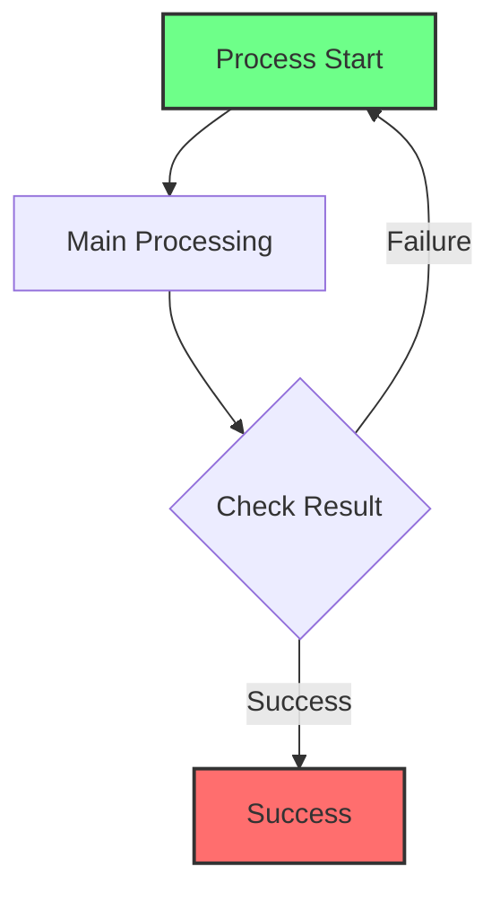
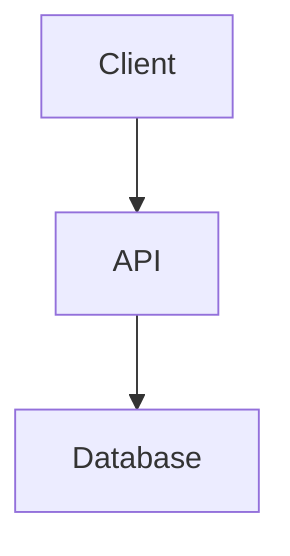
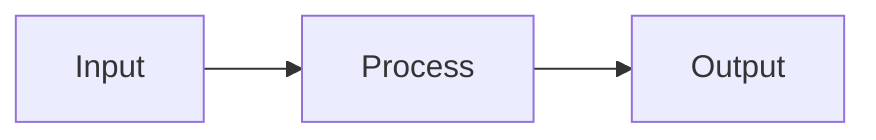

# Mermaid Chart Generator - User Guide

## Table of Contents
1. [Introduction](#introduction)
2. [Quick Start Guide](#quick-start-guide)
3. [Installation](#installation)
4. [Using the GUI Tool](#using-the-gui-tool)
5. [Using Command Line Tools](#using-command-line-tools)
6. [Markdown Format Guide](#markdown-format-guide)
7. [Troubleshooting](#troubleshooting)
8. [Advanced Usage](#advanced-usage)
9. [Technical Documentation](#technical-documentation)

## Introduction

Welcome to the Mermaid Chart Generator! This tool helps you convert Markdown files containing Mermaid diagrams into professional DOCX documents and PNG images. Whether you're documenting software architecture, creating process flows, or preparing technical reports, this tool streamlines your workflow.

### Key Features
- **GUI Interface**: Easy-to-use graphical interface for file selection and export
- **Command Line**: Scriptable automation for batch processing
- **Multiple Output Formats**: Generate DOCX documents and PNG images
- **Cross-Platform**: Works on Windows, macOS, and Linux
- **Automatic Setup**: One-click environment configuration

## Quick Start Guide

### For Beginners: Using the GUI Tool

1. **Launch the Application**:
   ```bash
   python gui_tool.py
   ```

2. **Select Your Markdown File**:
   - Click "Browse..." next to "Markdown File"
   - Choose your `.md` file containing Mermaid diagrams

3. **Choose Output Directory**:
   - Click "Browse..." next to "Output Directory"
   - Select where you want the generated files saved

4. **Generate Documents**:
   - Click "Generate DOCX + Charts" to create a Word document with embedded diagrams
   - Click "Export Charts Only" to generate only PNG images

5. **Monitor Progress**:
   - Watch the progress bar and status messages
   - Check the log area for detailed information

### Example Workflow

1. Write your documentation in Markdown with Mermaid diagrams
2. Use the GUI tool to select your file
3. Choose where to save the output
4. Click "Generate DOCX + Charts"
5. Open the generated `.docx` file in Microsoft Word

## Installation

### Automated Setup (Recommended)

Run the setup script to install all dependencies automatically:

```bash
python setup_env.py
```

This will install:
- Python dependencies
- Node.js and npm (if not already installed)
- Mermaid CLI
- Pandoc (document converter)

### Manual Installation

If you prefer manual installation:

1. **Install Python 3.7+**: [python.org](https://python.org)
2. **Install Node.js**: [nodejs.org](https://nodejs.org)
3. **Install Mermaid CLI**:
   ```bash
   npm install -g @mermaid-js/mermaid-cli
   ```
4. **Install Pandoc**: [pandoc.org](https://pandoc.org/installing.html)

### Verification

After installation, verify everything works:

```bash
# Check Python
python --version

# Check Node.js
node --version
npm --version

# Check Mermaid CLI
mmdc --version

# Check Pandoc
pandoc --version
```

## Using the GUI Tool

### Main Interface

The GUI tool provides a user-friendly interface with these components:

1. **File Selection**: Browse and select Markdown files
2. **Output Directory**: Choose where to save generated files
3. **Action Buttons**:
   - Generate DOCX + Charts: Creates Word document with diagrams
   - Export Charts Only: Generates only PNG images
   - Clear: Resets all fields
4. **Progress Bar**: Shows conversion progress
5. **Status Area**: Displays current operation status
6. **Log Area**: Detailed output and error messages

### Step-by-Step GUI Usage

1. **Launch the GUI**:
   ```bash
   python gui_tool.py
   ```

2. **Select Input File**:
   - Click the first "Browse..." button
   - Navigate to your Markdown file
   - Click "Open"

3. **Set Output Location**:
   - The output directory defaults to your input file's location
   - Click the second "Browse..." to change it
   - Select a folder and click "OK"

4. **Choose Export Option**:
   - For complete documentation: Click "Generate DOCX + Charts"
   - For just images: Click "Export Charts Only"

5. **Wait for Completion**:
   - Monitor the progress bar
   - Read status messages
   - Check the log for details

6. **Access Your Files**:
   - DOCX files are saved in the output directory
   - PNG images are saved in a `flowchats/` subfolder

## Using Command Line Tools

### export_document.py

Convert Markdown to DOCX with embedded diagrams:

```bash
# Basic usage
python export_document.py my_document.md

# Custom output directory
python export_document.py my_document.md --output-dir ./output

# Help information
python export_document.py --help
```

### export_flowcharts_only.py

Export only Mermaid diagrams to PNG:

```bash
# Basic usage
python export_flowcharts_only.py my_document.md

# Custom output directory
python export_flowcharts_only.py my_document.md --output-dir ./images

# Help information
python export_flowcharts_only.py --help
```

### Batch Processing

You can automate multiple files:

```bash
# Process all Markdown files in a directory
for file in *.md; do
    python export_document.py "$file"
done
```

## Markdown Format Guide

### Basic Mermaid Diagram

Your Markdown file should include Mermaid code blocks:

````markdown
# My Document

Here's a simple flowchart:


````

### Supported Diagram Types

The tool supports all Mermaid diagram types:

1. **Flowcharts**:
   ```mermaid
   flowchart TD
       A --> B
   ```

2. **Sequence Diagrams**:
   ```mermaid
   sequenceDiagram
       Alice->>John: Hello John!
       John-->>Alice: Hi Alice!
   ```

3. **Class Diagrams**:
   ```mermaid
   classDiagram
       Class01 <|-- Class02
       Class03 *-- Class04
   ```

4. **State Diagrams**:
   ```mermaid
   stateDiagram-v2
       [*] --> Still
       Still --> [*]
   ```

### Formatting Tips

1. **Always include the language specifier**:
   ```markdown
   ```mermaid
   # Correct
   ```
   
   ```markdown
   ```
   # Incorrect - will not be processed
   ```
   ```

2. **Use descriptive node labels**:
   ```mermaid
   flowchart TD
       Start[Process Start] --> Validate[Validate Input]
   ```

3. **Style your diagrams**:
   ```mermaid
   flowchart TD
       style Start fill:#f9f,stroke:#333,stroke-width:4px
       Start --> Process
   ```

## Troubleshooting

### Common Issues

1. **"Mermaid CLI not installed"**
   - Run: `npm install -g @mermaid-js/mermaid-cli`
   - Or use the setup script: `python setup_env.py`

2. **"Pandoc not found"**
   - Install Pandoc from: https://pandoc.org/installing.html
   - Or use the setup script

3. **Diagrams not being detected**
   - Ensure your code blocks start with ```` ```mermaid ````
   - Check that the closing ```` ``` ```` is on its own line

4. **Permission errors**
   - On Linux/macOS, you may need to use `sudo` for global npm installs
   - Alternatively, install tools locally without `-g` flag

### Error Messages

- **"Input file not found"**: Check the file path and permissions
- **"No Mermaid flowcharts found"**: Verify your Markdown formatting
- **"Conversion failed"**: Check if all dependencies are installed

### Getting Help

1. Check this guide first
2. Run with `--help` flag for command-specific options
3. Check the log output in the GUI tool
4. Ensure all dependencies are properly installed

## Advanced Usage

### Custom Styling

You can style your Mermaid diagrams:

````markdown

````

### Multiple Diagrams

You can include multiple diagrams in one document:

````markdown
# System Architecture

## Component Diagram


## Data Flow

````

### Integration with CI/CD

You can integrate the tool into automated workflows:

```yaml
# GitHub Actions example
name: Generate Documentation
on: [push]
jobs:
  generate-docs:
    runs-on: ubuntu-latest
    steps:
    - uses: actions/checkout@v2
    - name: Setup Python
      uses: actions/setup-python@v2
    - name: Install dependencies
      run: python setup_env.py
    - name: Generate documentation
      run: python export_document.py README.md
    - name: Upload artifacts
      uses: actions/upload-artifact@v2
      with:
        name: generated-docs
        path: "*.docx"
```

## Technical Documentation

### File Structure

```
mermaid-chart-generator/
├── gui_tool.py            # Graphical user interface
├── export_document.py     # Main export script
├── export_flowcharts_only.py # Chart-only export
├── setup_env.py           # Environment setup
├── user_guideline.md      # This guide
├── requirements.txt       # Python dependencies
├── LICENSE               # Jimmywongiot license
└── README.md             # Project overview
```

### How It Works

1. **Input Processing**: The tool reads your Markdown file
2. **Mermaid Extraction**: Identifies and extracts Mermaid code blocks
3. **Diagram Conversion**: Uses Mermaid CLI to convert diagrams to PNG
4. **Document Generation**: Uses Pandoc to create DOCX with embedded images
5. **Output Organization**: Saves files in specified directories

### API Reference

#### export_document.py

```python
# Main class
class DocumentExporter:
    def export_to_docx(input_file, output_file=None):
        """Convert Markdown to DOCX"""
    
    def export_flowcharts_to_images(input_file, output_dir='flowchats'):
        """Export diagrams to PNG"""
```

#### export_flowcharts_only.py

```python
class FlowchartExporter:
    def export_flowcharts(input_file, output_dir='flowchats'):
        """Export only diagrams to PNG"""
```

### Extension Points

You can extend the tool by:

1. **Adding new export formats** by modifying the export scripts
2. **Customizing diagram styles** through Mermaid configuration
3. **Integrating with other tools** via the command-line interface

### Performance Considerations

- Large documents with many diagrams may take longer to process
- PNG generation is the most resource-intensive operation
- Consider using smaller diagram sizes for better performance

---

**Need more help?** Check the README.md file for additional information and support options.

*Last updated: September 2025*
